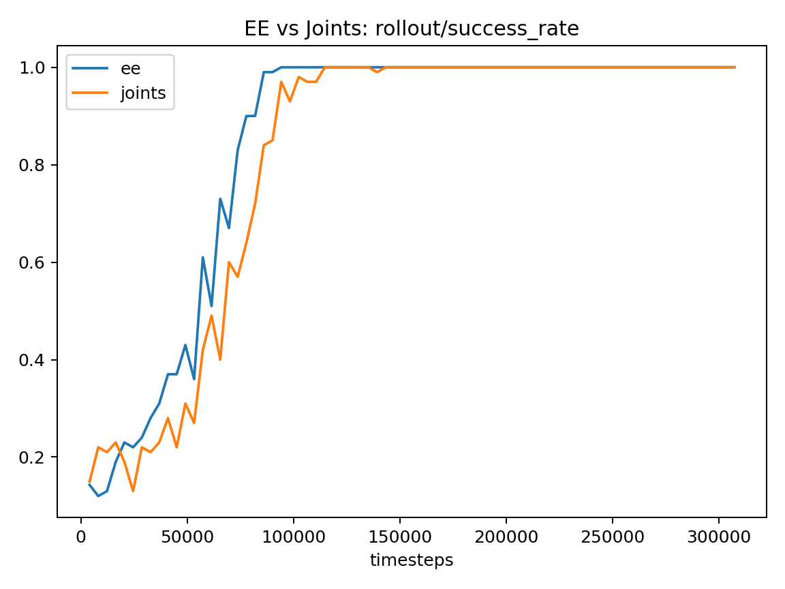
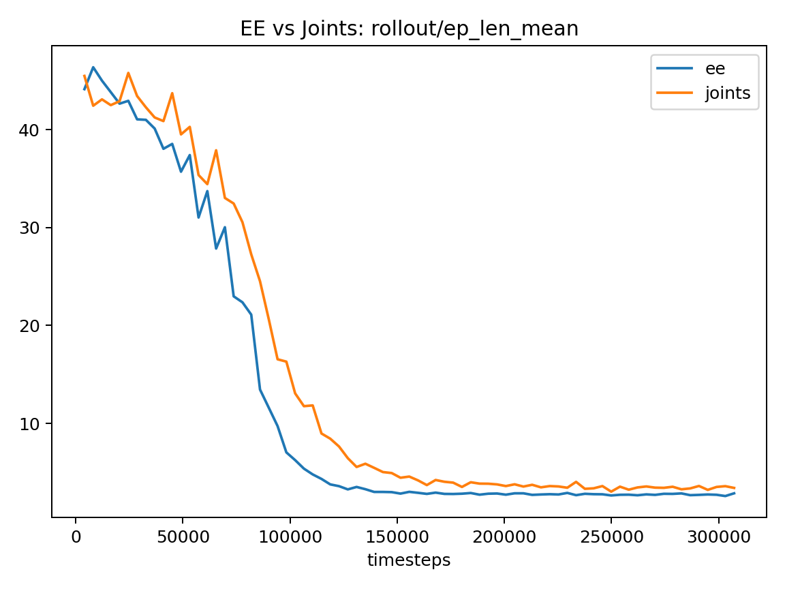
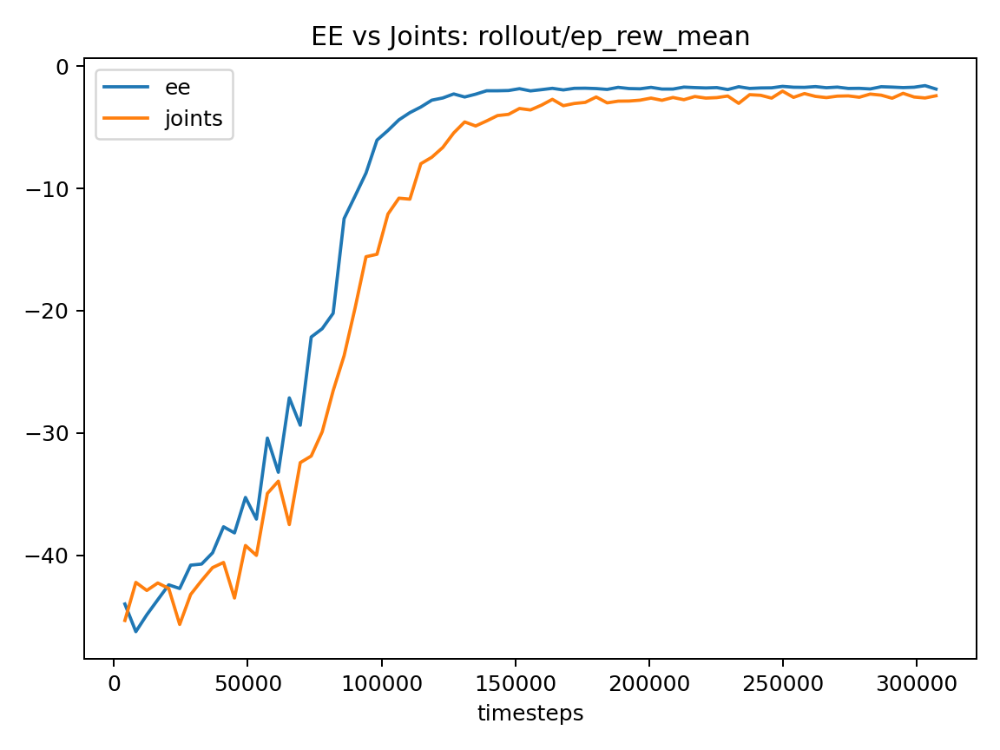
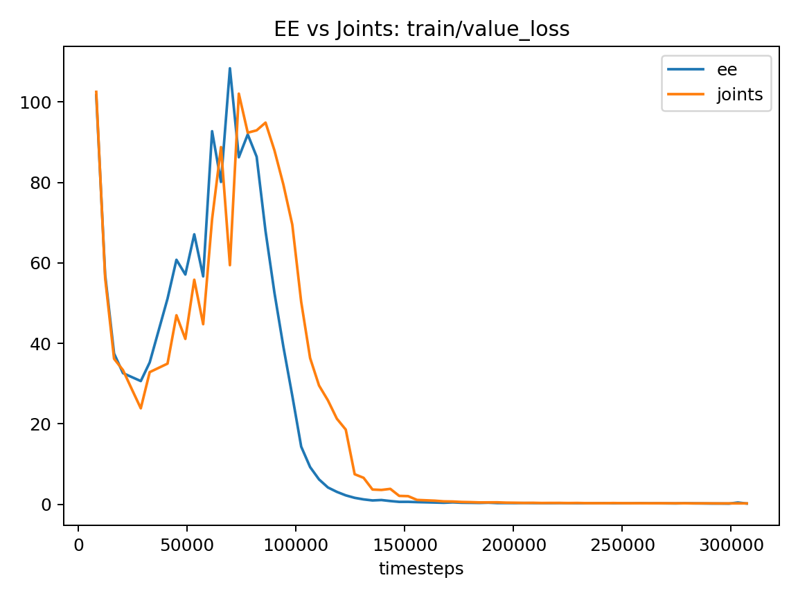
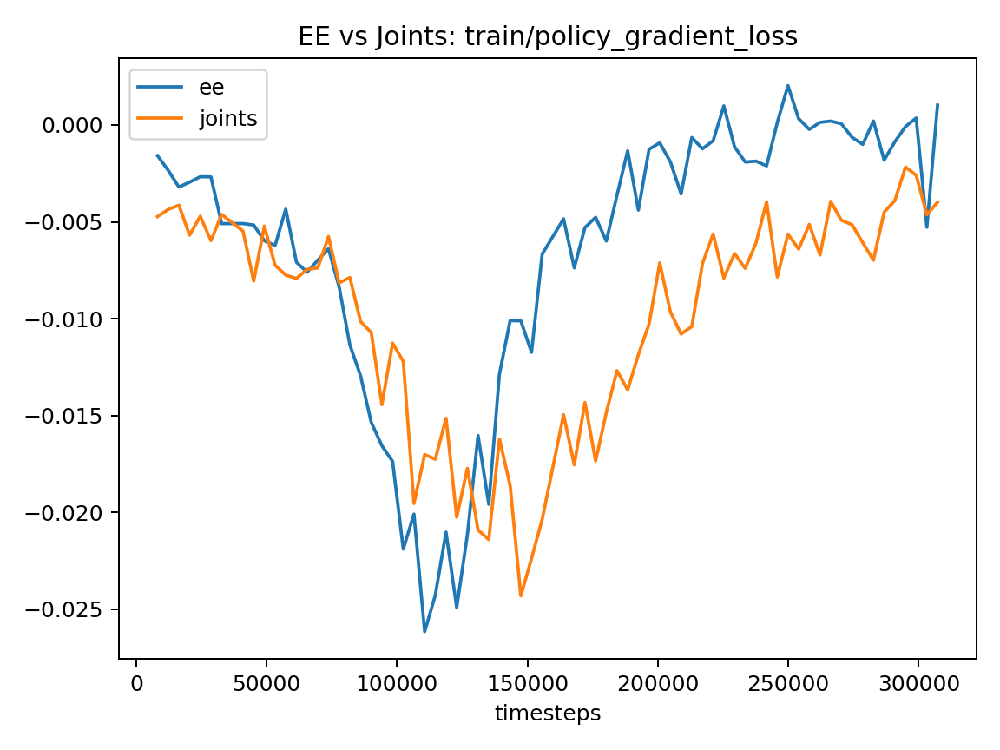
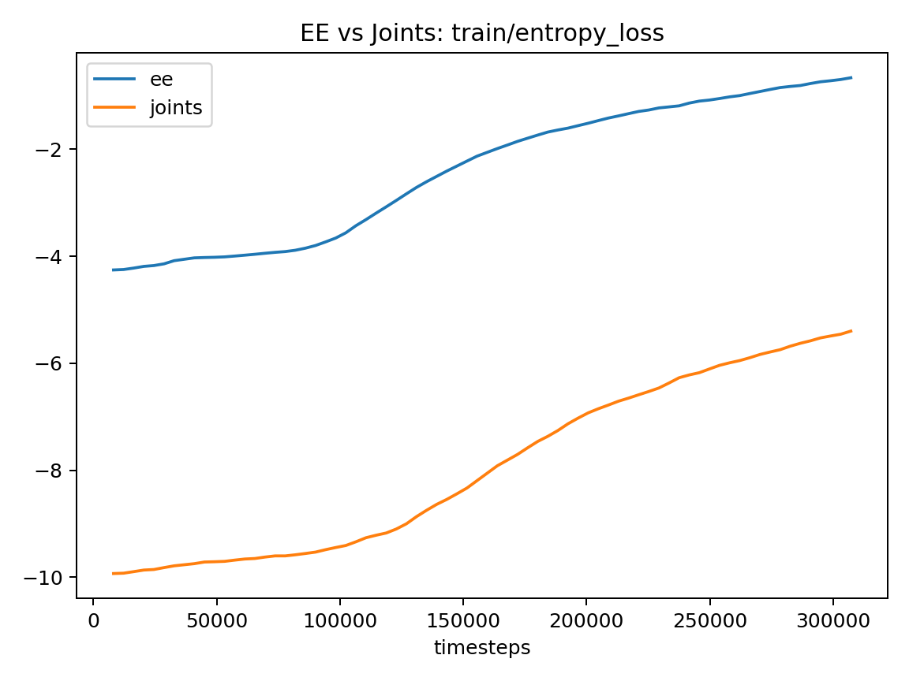
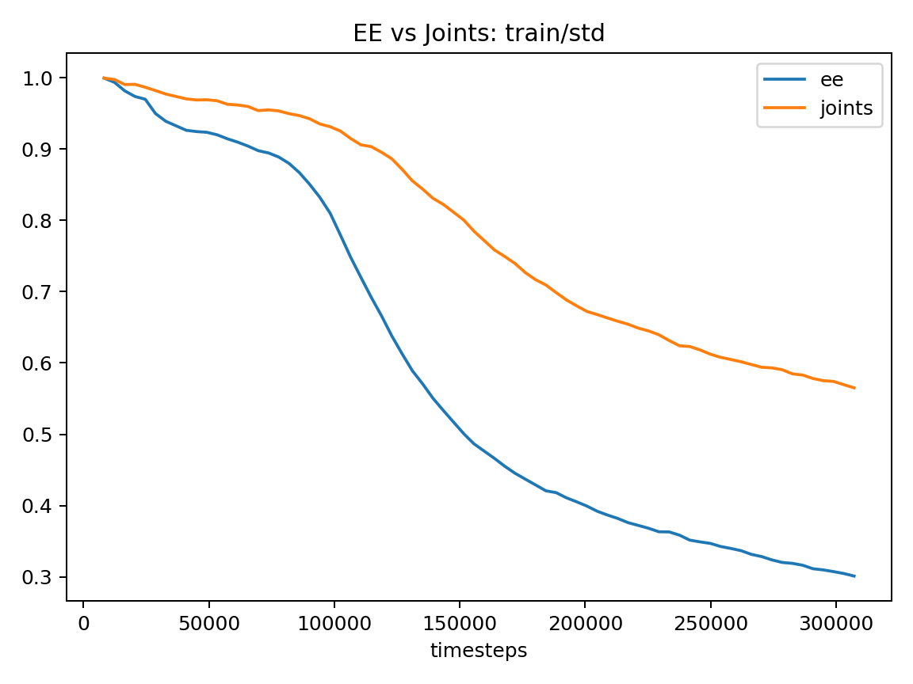
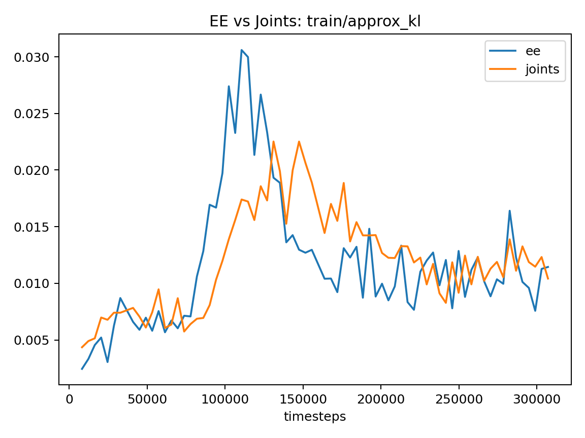
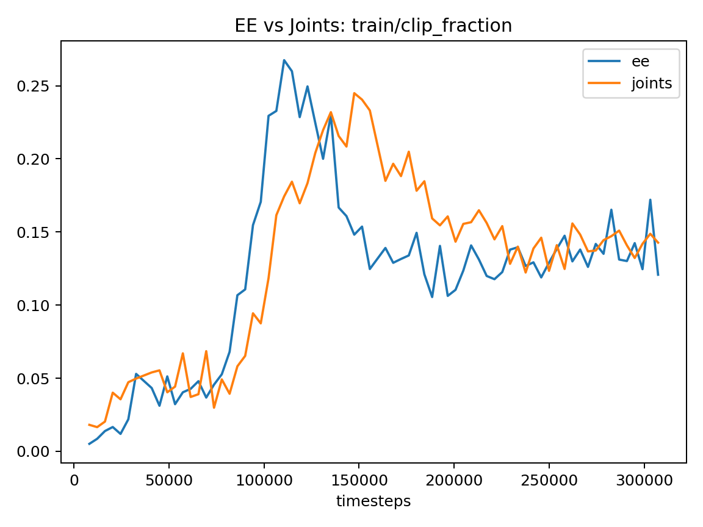
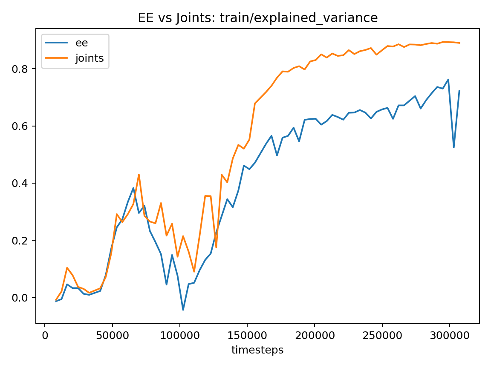

# Relatório de evidências: PandaReach

## Artefactos gerados

- Manifest: `manifest.json`
- plots_overlay:
  - `plots/overlay_success_rate.png`
  - `plots/overlay_ep_len_mean.png`
  - `plots/overlay_ep_rew_mean.png`
  - `plots/overlay_value_loss.png`
  - `plots/overlay_policy_gradient_loss.png`
  - `plots/overlay_entropy_loss.png`
  - `plots/overlay_std.png`
  - `plots/overlay_approx_kl.png`
  - `plots/overlay_clip_fraction.png`
  - `plots/overlay_explained_variance.png`
- tables:
  - `eval_results.csv`
  - `eval_summary.md`

## Fluxo completo (o que foi medido)

1) Extração de *scalars* do TensorBoard (ficheiros `events.out.tfevents.*`).
2) Identificação de marcos do treino (thresholds e estabilização).
3) Avaliação de checkpoints (determinística e/ou estocástica) para várias seeds.
4) Consolidação em tabelas e gráficos (apenas overlays EE vs Joints).

## Logs de treino encontrados

### ee
- run_dir: `/home/tiago/work/panda-gym/runs/PandaReach/ee/ppo_1`
- status: `ok`
- n_tags: `14`

### joints
- run_dir: `/home/tiago/work/panda-gym/runs/PandaReach/joints/ppo_1`
- status: `ok`
- n_tags: `14`

## Marcos do treino (a partir de `rollout/*`)

### ee
- final_step: `307200`
- final_success: `1.0`
- final_ep_len: `2.86`
- step_success_95_stable: `86016`
- step_success_99_stable: `86016`
- step_success_100_stable: `94208`
- step_len_le_3_stable: `159744`

### joints
- final_step: `307200`
- final_success: `1.0`
- final_ep_len: `3.41`
- step_success_95_stable: `102400`
- step_success_99_stable: `114688`
- step_success_100_stable: `143360`
- step_len_le_3_stable: `None`

## Avaliação por checkpoint (média±desvio; min/max)

| eval | modo | checkpoint | n | return (m±sd) | success (m±sd) | len (m±sd) |
|---|---|---:|---:|---:|---:|---:|
| deterministic | ee | ckpt10.zip | 5 | -44.980±0.000 | 0.120±0.000 | 45.10±0.00 |
| deterministic | ee | final.zip | 5 | -1.560±0.014 | 1.000±0.000 | 2.56±0.01 |
| deterministic | ee | mid.zip | 5 | -1.600±0.014 | 1.000±0.000 | 2.60±0.01 |
| deterministic | joints | ckpt10.zip | 5 | -45.380±0.000 | 0.100±0.000 | 45.48±0.00 |
| deterministic | joints | final.zip | 5 | -2.140±0.037 | 1.000±0.000 | 3.14±0.04 |
| deterministic | joints | mid.zip | 5 | -2.308±0.041 | 1.000±0.000 | 3.31±0.04 |
| stochastic | ee | ckpt10.zip | 5 | -38.448±1.915 | 0.340±0.032 | 38.79±1.88 |
| stochastic | ee | final.zip | 5 | -1.644±0.038 | 1.000±0.000 | 2.64±0.04 |
| stochastic | ee | mid.zip | 5 | -1.828±0.054 | 1.000±0.000 | 2.83±0.05 |
| stochastic | joints | ckpt10.zip | 5 | -41.360±0.469 | 0.256±0.033 | 41.62±0.45 |
| stochastic | joints | final.zip | 5 | -2.216±0.046 | 1.000±0.000 | 3.22±0.05 |
| stochastic | joints | mid.zip | 5 | -3.088±0.094 | 1.000±0.000 | 4.09±0.09 |

## Gráficos principais

### Comparação EE vs Joints (overlay)

