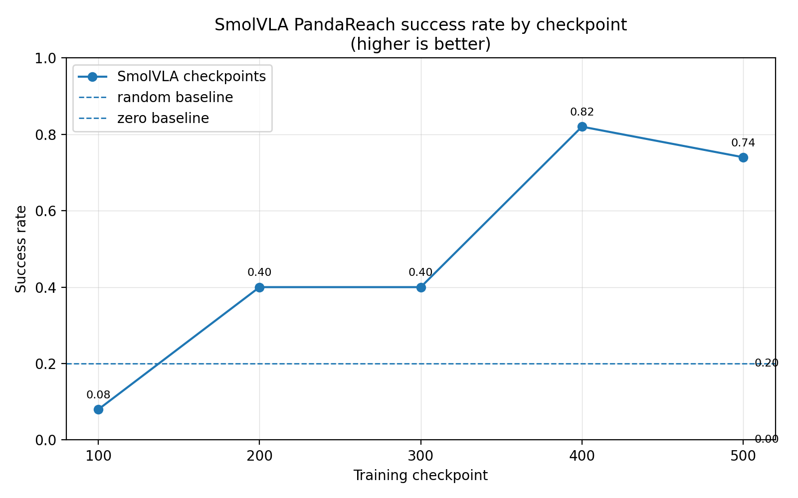
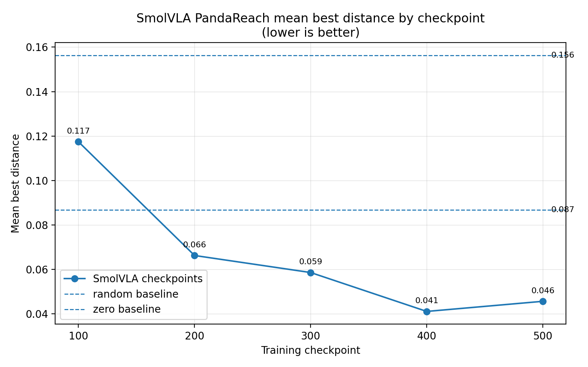
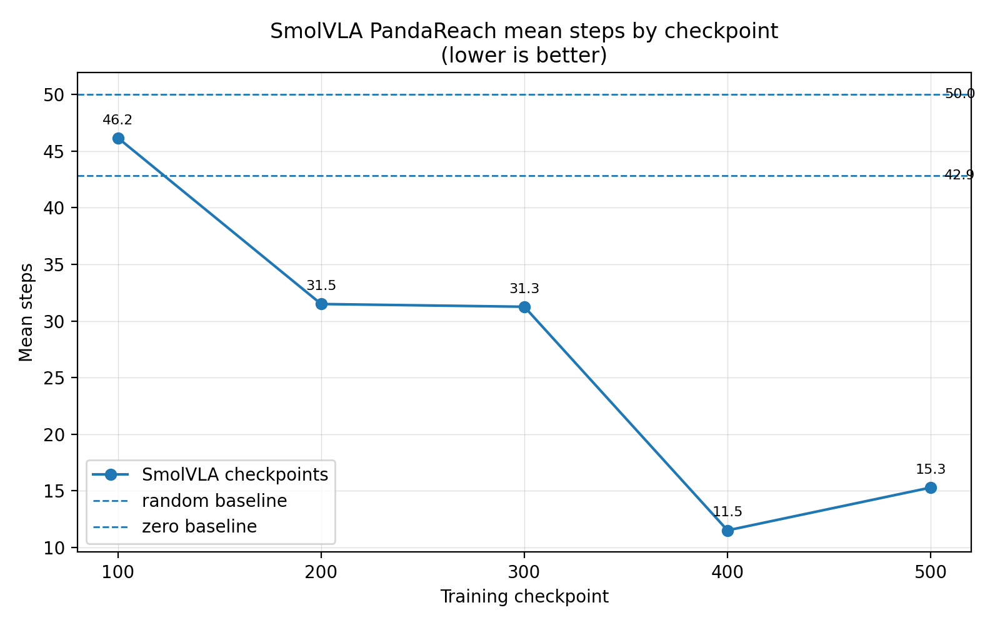

# SmolVLA PandaReach checkpoint plots

Generated from:

- `evidence/smolvla_pandareach_checkpoint_comparison/checkpoint_comparison.csv`
- `evidence/smolvla_pandareach_results/rollout_results_compact.csv`

## Plots

### Success rate

### Mean best distance

### Mean steps

## Best observed checkpoints

- Best success rate: checkpoint `000400` with `0.82`.
- Best mean best distance: checkpoint `000400` with `0.0411`.
- Best mean steps: checkpoint `000400` with `11.52`.

## Baselines

- `random`: success_rate=`0.20`, mean_best_distance=`0.0868`, mean_steps=`42.86`.
- `zero`: success_rate=`0.00`, mean_best_distance=`0.1563`, mean_steps=`50.00`.
